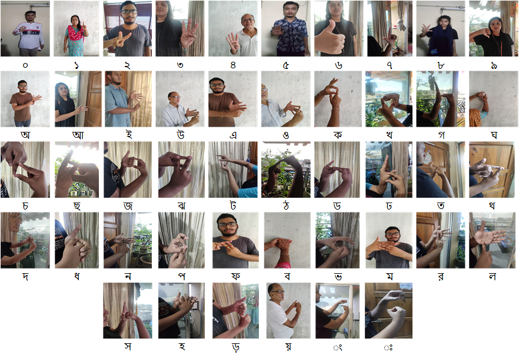
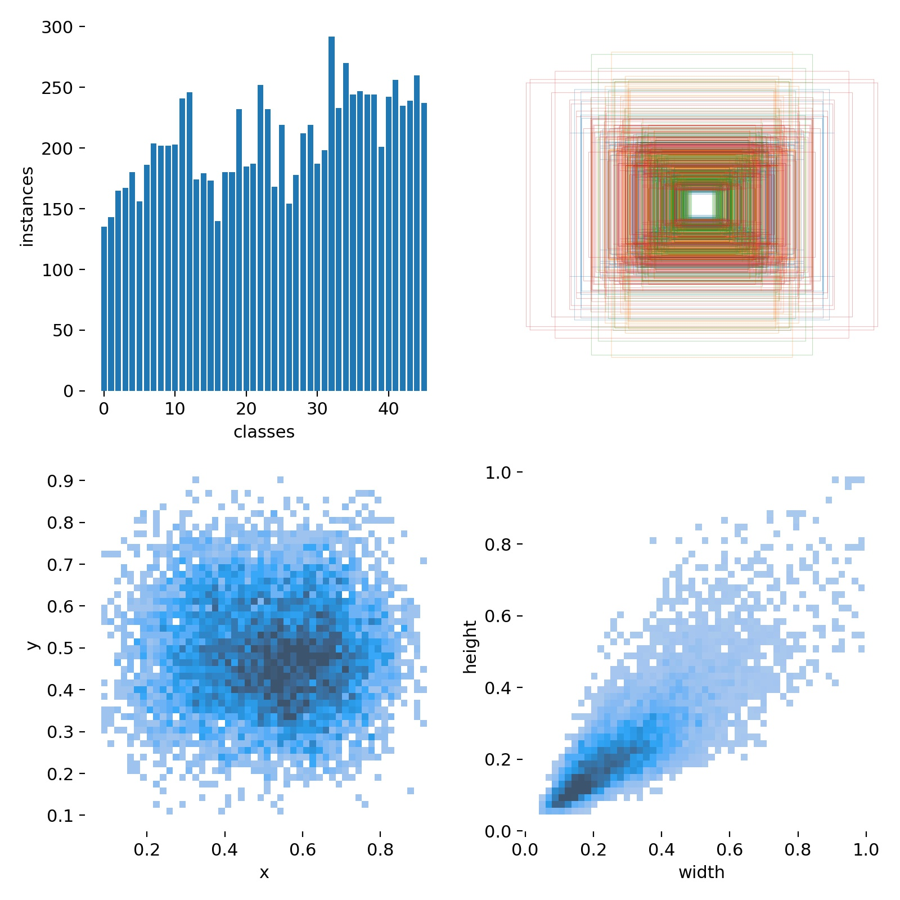
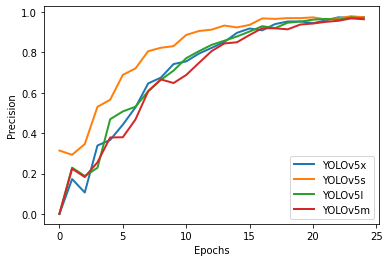
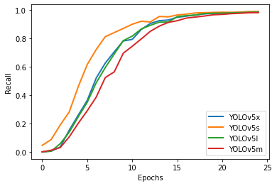
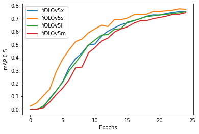
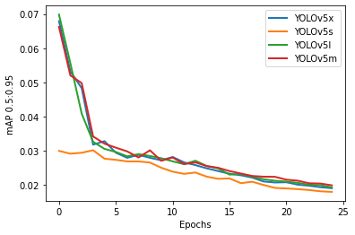

# OkkhorNama: Bangladeshi Sign Language Dataset For Real Time Object Detection Algorithms
<br>

## ❄️ Abstract
<p>In recent years, lots of researches are being conducted to interpret Bangladeshi Sign Language (BdSL) to the means that general people can communicate with people having a hearing impairment and reduce the verbal gap between them. Computer Vision is playing a vital role in this regard by developing a sustainable system to understand the signs for machine translations. To obtain optimal performance, along with the state-of-the-art CNN model, the requirement of a high-quality sign language dataset cannot be foreseen. In this paper, we have introduced a new image dataset OkkhorNama for Fingerspelled Bangladeshi Sign Language including all 46 signs with images over 12K. In each of the images, bounding boxes are carefully annotated and labeled. OkkhorNama contains images of high resolution, good quality, and adequate variation making it ideal to train object detection and localization algorithms that would perform well on real-world applications. The OkkhorNama dataset is compared with other datasets where OkkhorNama significantly outperforms other datasets in number and trained model performance. The dataset is publicly available for future research and development.</p>


##   🌳 Dataset Overview

<p>For research and development in Bangla Sign Language (BdSL) detection in real-time, we have developed a dataset that contains images of all the 46 signs available in BdSL. Existing datasets have two major issues. Either they are not suitable for object detection task as it requires high-quality images or they don't contain all the 46 signs. But for building a full-fledged system for BdSL detection high-resolution images from all the existing signs are required. To meet these requirements we have developed a dataset containing 12000 high-resolution images from 46 different classes of BdSL.</p>




<br>

## Dataset Complexity

<p>Real-time object detection requires images of high resolution so all the 12K images in OkkhorNama are of high resolution with different variants in the background, lighting, position, etc. Keeping in mind the real-world scenarios we have taken the images with different backgrounds and under various lighting conditions. Images in each class have a blend of different backgrounds to maintain diversity. The lighting conditions used in our dataset consist of bright sunlight, indoor artificial light, shadowy, etc. Also, images were taken from different angles and different positions.</p>

| Dataset | Characterisitics | Condition | Avaialability |
| --- | ---| ---| --- |
| OkkhorNama | Lighting         | Bright Sunlight | ✅ |
|            |                  | Artificial Light | ✅ |
|            | Capturing Spot   | Indoor          | ✅ |
|            |                  | Outdoor         |  ✅ |
|            | Image Background       | Simple          | ✅ |
|            |                  | Complex         | ✅ |
|            |                  | Shadowy         | ✅ |
|            | Capturing Time   | Day          | ✅ |
|            |                  | Night         |  ✅ |

<br>


## 📊  Dataset Statistics

OkkhorNama consists of around 12K images of 46 different categories consisting of ten Bangla digits, six Bangla vowels, and thirty Bangla consonants. 
Following figure gives a statistical overview of our dataset. The top left image indicates the histogram of the category distribution from where we can observe that the dataset is almost balanced with a few fluctuations. The top right image represents the heatmap of the labels' positions where the center of each label is plotted as a point.
Heatmap of labels' dimension is plotted in the bottom images where the bottom left one depicts the x-coordinate and y-coordinate of the labels as a point and the bottom right one depicts the width and height of the labels as a point.



## 📈 Training Result 

<p>We evaluated our OkkhorNama Dataset using state-of-the-art object detection algorithm YOLOv5 . Various
versions of the YOLOv5 model (YOLOv5s, YOLOv5m,
YOLOv5l, YOLOv5x) are used in this experiment to test
the dataset’s usability.</p>

|  |  |
| --- | --- |
|  |  | 
|  |  | 


##  🔗 Important Links

To acquire more details regarding OkkhorNama dataset and training environment with hyperparameter list follow the links to the paper and dataset below:

[Researchgate](https://www.researchgate.net/publication/355357779_OkkhorNama_BdSL_Image_Dataset_For_Real_Time_Object_Detection_Algorithms)

[IEEE Xplore Library](https://ieeexplore.ieee.org/document/9550907)

[Dataset Link](https://drive.google.com/drive/folders/1uQEwq1q4GJzOY6cjmpZlzdg-AuVRwdKn)


## 📄 Citation 

Please cite the OkkhorNama as follows:

#### BibTeX Format
```
@INPROCEEDINGS{9550907,
  author={Talukder, Dipon and Jahara, Fatima and Barua, Suvadra and Haque, Md. Mokammel},
  booktitle={2021 IEEE Region 10 Symposium (TENSYMP)}, 
  title={OkkhorNama: BdSL Image Dataset For Real Time Object Detection Algorithms}, 
  year={2021},
  volume={},
  number={},
  pages={1-6},
  doi={10.1109/TENSYMP52854.2021.9550907}}
```


#### Plain Text Format
```
D. Talukder, F. Jahara, S. Barua and M. M. Haque, "OkkhorNama: BdSL Image Dataset For Real Time Object Detection Algorithms," 2021 IEEE Region 10 Symposium (TENSYMP), 2021, pp. 1-6, doi: 10.1109/TENSYMP52854.2021.9550907.
```
## 📧 Author's Contact Information 

Feel free to contact with the authors for any queries.

| Author Name | Email | Linkedin Profile| 
| --- | ---| ---|
| Dipon Talukder | dipontalukder12@gmail.com   | [Dipon's Profile](https://www.linkedin.com/in/dipontalukder/)
| Fatima Jahara | fatimajahara@ieee.org   | [Fatima's Profile](https://www.linkedin.com/in/fatimajahara/)
| Suvadra Barua | suvadrabarua21@gmail.com   | [Suvadra's Profile](https://www.linkedin.com/in/suvadra-barua/)
| Md. Mokammel Haque | mokammel@cuet.ac.bd   | - |
